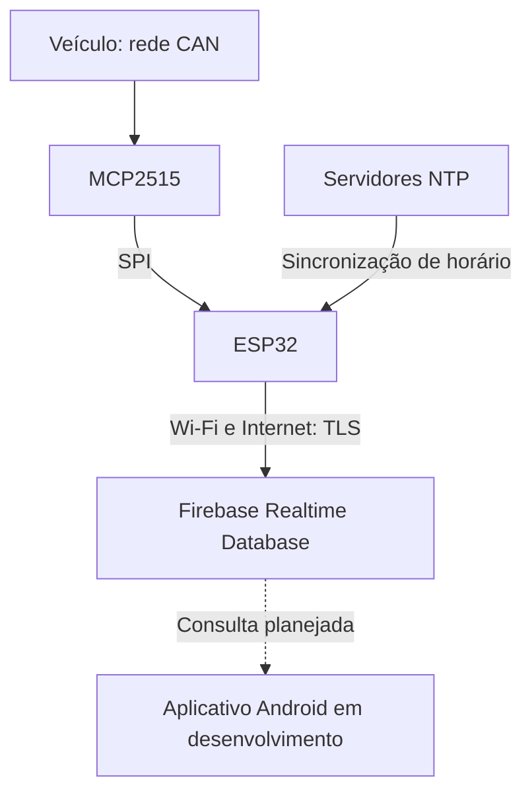

# Arquitetura de rede, comunicação e segurança

## Fluxo

| Trecho | Configuração ou estado |
| --- | --- |
| CAN → MCP2515 | 50 kbit/s e oscilador de 8 MHz no firmware |
| MCP2515 → ESP32 | SPI; CS GPIO 5; INT GPIO 4; demais pinos a documentar |
| ESP32 → rede | Wi-Fi com SSID/senha privados |
| ESP32 → Firebase | Cliente TLS e FirebaseClient; autenticação por e-mail/senha |
| ESP32 → NTP | pool.ntp.org e time.nist.gov; UTC-3 |
| Firebase → aplicativo | Integração pendente; app em desenvolvimento no Android Studio |

## Segurança presente no código

- Autenticação Firebase com e-mail/senha.
- Uso de cliente TLS na comunicação com o Firebase.
- Credenciais e identificadores de ambiente separados em arquivo local excluído do versionamento na versão preparada para publicação.

## Limitações e próximos passos

### Certificado TLS

A chamada `set_ssl_client_insecure_and_buffer(ssl_client)` desativa a validação do certificado. Não é correto apresentar a conexão como plenamente autenticada e segura: falta comprovar a identidade do servidor. Corrigir essa configuração conforme a versão da biblioteca e testar a validação de certificados.

### Autorização no banco

As regras do Firebase não foram fornecidas. A autenticação do cliente, isoladamente, não demonstra restrição adequada de leitura/escrita. Documentar e testar regras que autorizem apenas usuários/dispositivos previstos e validem formato e limites dos dados.

### Rede CAN

O código usa `MCP_NORMAL`, sem chamadas explícitas para transmitir quadros. Modo normal não equivale a escuta passiva: não afirmar isolamento do barramento ou operação listen-only. A instalação elétrica e o comportamento no veículo ainda precisam de validação.

### Configurações privadas

Copiar `secrets.example.h` para `secrets.h` apenas localmente. Não enviar o arquivo preenchido nem o arquivo original com configurações reais. A exclusão do Git evita publicação; não criptografa os dados dentro do firmware.

### Dados e disponibilidade

Não há fila offline ou retentativa por amostra explícita no código. Wi-Fi ausente pode bloquear a inicialização. Temperatura e combustível preservam os últimos valores após timeout, sem marcador de atualização. O timestamp pode ser inválido se o NTP falhar. Essas limitações devem aparecer nos testes e na interpretação do aplicativo.

## Evidências para a apresentação

Mostrar configuração de autenticação e regras do banco sem expor contas, senhas ou identificadores privados. Separar os controles implementados das correções planejadas. Evidências ainda precisam ser adicionadas pelo grupo.
